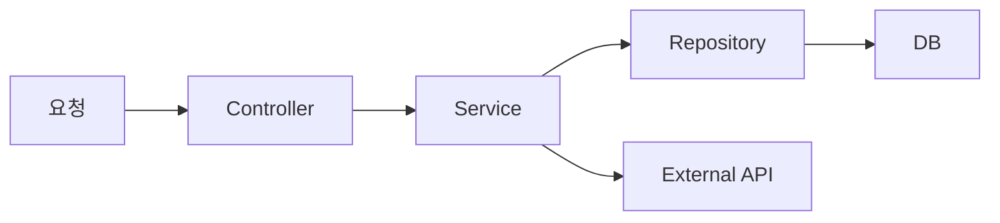

# Architecture

<!--
  이 파일은 프로젝트의 최상위 아키텍처 맵입니다.
  에이전트가 전체 구조를 한눈에 파악할 수 있도록 작성하세요.
  상세 규칙은 docs/architecture/에 기술합니다.

  작성 가이드:
  1. System Overview: 핵심 흐름을 ASCII 또는 Mermaid 다이어그램으로 표현
  2. Tech Stack: 사용 기술 목록
  3. Layer Map: docs/architecture/layers.md의 요약 (레이어와 방향만)
  4. Key Design Decisions: 왜 이 구조를 선택했는지 (에이전트가 의도를 이해)
  5. Cross-Cutting Concerns: 전체 레이어에서 접근 가능한 모듈
-->

## System Overview

<!-- 시스템의 핵심 흐름을 1개 다이어그램으로 표현하세요 -->
<!-- ASCII 또는 Mermaid 모두 가능합니다 -->

<!--
예시 (ASCII):
```
요청 → Controller → Service → Repository → DB
                        ↓
                    External API
```

예시 (Mermaid):

-->

## Tech Stack

| Category | Choice | Notes |
|----------|--------|-------|
| Language | | <!-- 예: Python 3.11, Java 17, TypeScript 5.x --> |
| Framework | | <!-- 예: FastAPI, Spring Boot, React, Next.js --> |
| Database | | <!-- 예: PostgreSQL, Oracle, MongoDB --> |
| ORM/Query | | <!-- 예: SQLAlchemy, JPA, Prisma --> |
| Infrastructure | | <!-- 예: Docker, K8s, AWS --> |

## Layer Map

<!-- docs/architecture/layers.md의 요약입니다 -->
<!-- 레이어 이름과 의존 방향만 간단히 표시하세요 -->

<!--
예시:
```
Controller → Service → Repository → Model → Schema
```
-->

## Key Design Decisions

<!-- 왜 이 구조를 선택했는지 기술하세요 -->
<!-- 에이전트가 구조의 의도를 이해하고 일관된 코드를 생성하는 데 도움이 됩니다 -->

| Decision | Rationale |
|----------|-----------|
<!-- 예:
| Layered Architecture | 에이전트가 의존성 방향을 추론하기 쉬움 |
| DI Container | 서비스 간 결합도 최소화, 테스트 용이 |
| YAML 프롬프트 | LLM 프롬프트를 코드와 분리하여 관리 |
-->

## Cross-Cutting Concerns

<!-- 전체 레이어에서 접근 가능한 모듈을 기술하세요 -->
<!-- docs/architecture/cross-cutting.md에 상세 내용 기술 -->

| Module | Purpose |
|--------|---------|
<!-- 예:
| auth | 인증/인가 |
| logging | 로깅 |
| exceptions | 공통 예외 계층 |
| utils | 공유 유틸리티 |
-->

## References

- 상세 레이어 정의: [`docs/architecture/layers.md`](docs/architecture/layers.md)
- 의존성 규칙: [`docs/architecture/dependency-rules.md`](docs/architecture/dependency-rules.md)
- 횡단 관심사: [`docs/architecture/cross-cutting.md`](docs/architecture/cross-cutting.md)
